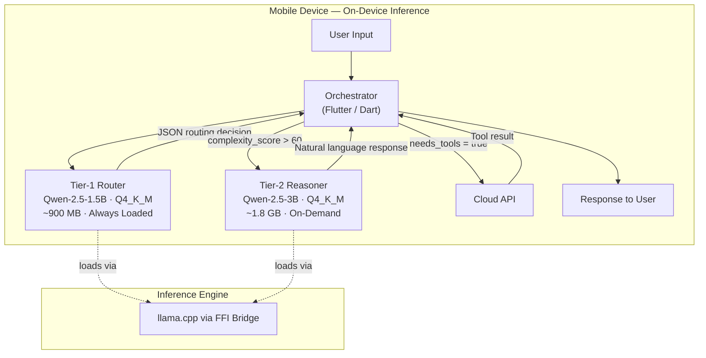
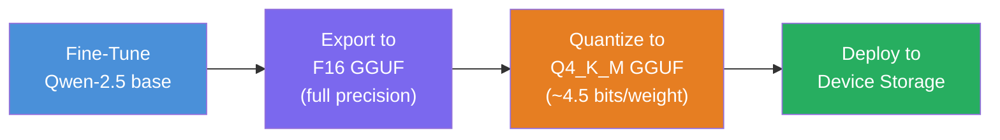
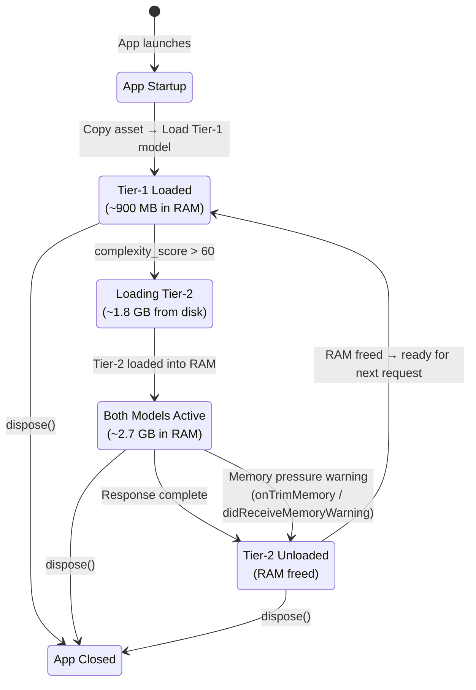
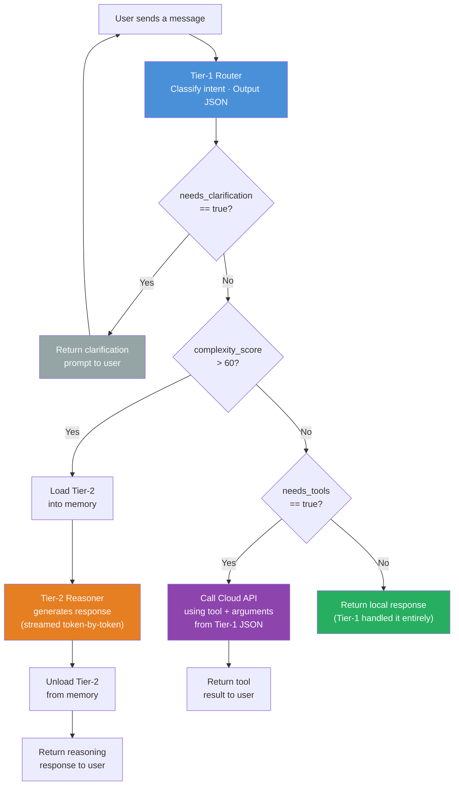
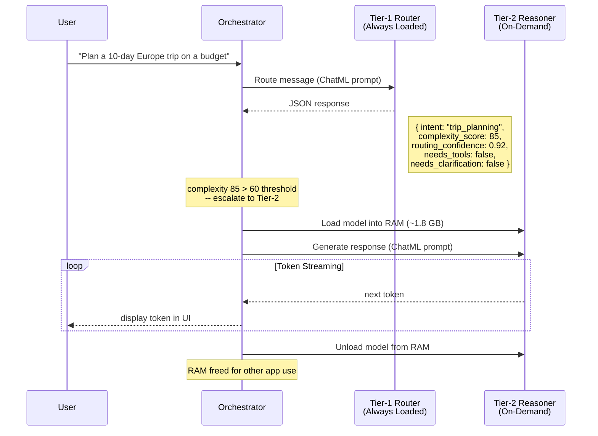
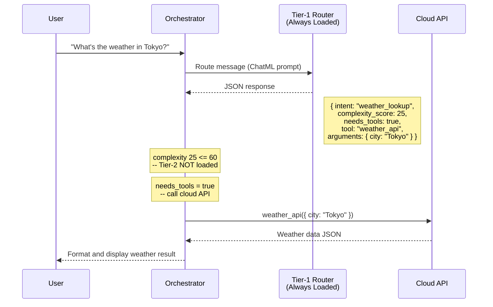
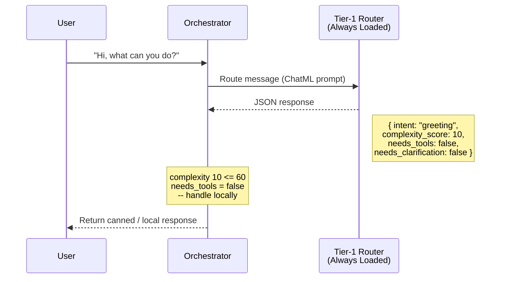

# Running GGUF Models Offline on Device in Flutter (Tier-1 & Tier-2)

## Overview

This guide explains how to run your fine-tuned Qwen-2.5 GGUF models **locally and offline** inside a Flutter app. The architecture uses two separate models:

- **Tier-1 (Router):** A small, always-on model (Qwen-2.5-1.5B) that classifies intent, routes requests, and outputs strict JSON. It never generates long text.
- **Tier-2 (Reasoner):** A larger, on-demand model (Qwen-2.5-3B or 7B) that handles deep reasoning, explanations, and planning. It outputs natural language.

Both models are exported as `.gguf` files after fine-tuning and run on-device using a C++ inference engine (llama.cpp) via Flutter's FFI bridge.

### Architecture Overview



### Model Pipeline: Fine-Tune to Deployment



---

## Understanding GGUF File Formats: F16 vs Q4_K_M

After fine-tuning, you export your model to GGUF. The two most common formats are **F16** (full precision) and **Q4_K_M** (quantized). Understanding the difference is critical for choosing the right file for each tier.

### F16 (Float16 / Half Precision)

- **What it is:** The model weights are stored in 16-bit floating point. This is essentially the full-quality model with no compression.
- **File size:** Large. A 1.5B parameter model is ~3 GB; a 3B model is ~6 GB; a 7B model is ~14 GB.
- **Quality:** Maximum accuracy. No quality loss from the trained weights.
- **Speed:** Slower inference on mobile because more data must be read from memory per token.
- **RAM usage:** High. The entire model must fit in RAM at full precision.
- **When to use F16:**
  - During development and testing on a desktop/emulator to validate model correctness.
  - As the source file for producing quantized versions (you quantize FROM F16).
  - On high-end devices with abundant RAM where you want maximum quality and speed is not a concern.
  - **Never ship F16 to production mobile apps** unless targeting tablets or very high-end devices with 12+ GB RAM.

### Q4_K_M (4-bit Quantization, K-Quant Medium)

- **What it is:** The model weights are compressed to ~4.5 bits per weight using the K-quant method with medium quality settings. This is a lossy compression, but the quality loss is minimal for well-trained models.
- **File size:** Much smaller. A 1.5B parameter model is ~900 MB; a 3B model is ~1.8 GB; a 7B model is ~4 GB.
- **Quality:** Very close to F16 for most tasks. Routing/classification (Tier-1) and natural language generation (Tier-2) both survive Q4_K_M quantization well. Minor degradation is possible on edge-case reasoning tasks.
- **Speed:** Faster inference on mobile because less memory bandwidth is needed per token.
- **RAM usage:** Significantly lower. This is what makes on-device inference practical.
- **When to use Q4_K_M:**
  - **Production mobile apps** -- this is the standard format for shipping.
  - Both Tier-1 and Tier-2 models in your Flutter app.
  - Any device with limited RAM (which is every phone).

### Quick Comparison Table

| Aspect | F16 (Half Precision) | Q4_K_M (4-bit Quantized) |
|--------|---------------------|--------------------------|
| Bits per weight | 16 | ~4.5 |
| 1.5B model size | ~3 GB | ~900 MB |
| 3B model size | ~6 GB | ~1.8 GB |
| 7B model size | ~14 GB | ~4 GB |
| Quality loss | None | Minimal |
| Inference speed | Slower | Faster |
| RAM required | High | Low |
| Use case | Dev/testing, source for quantization | Production mobile deployment |

### How to Convert F16 to Q4_K_M

If you have an F16 GGUF and need to quantize it:

```bash
# Using llama.cpp's quantize tool
./quantize  model_f16.gguf  model_q4_k_m.gguf  Q4_K_M
```

You always fine-tune first, export to F16 GGUF, then quantize to Q4_K_M for deployment.

---

## Which GGUF Files You Need

For the Tier-1 / Tier-2 architecture, you will have **two separate GGUF files**:

| File | Model | Role | Recommended Format | Approximate Size |
|------|-------|------|--------------------|-----------------|
| `tier1_router_q4_k_m.gguf` | Qwen-2.5-1.5B (fine-tuned) | Intent routing, JSON output | Q4_K_M | ~900 MB |
| `tier2_reasoner_q4_k_m.gguf` | Qwen-2.5-3B (fine-tuned) | Reasoning, natural language | Q4_K_M | ~1.8 GB |

**Total on-device storage:** ~2.7 GB (both models combined with Q4_K_M).

> **Note:** You do NOT need to load both models into RAM simultaneously. Tier-1 stays loaded. Tier-2 is loaded on-demand and unloaded when not needed.

---

## Step 1: Add Dependencies

Update your `pubspec.yaml`:

```yaml
dependencies:
    flutter:
        sdk: flutter
    llama_cpp_dart: ^0.1.3       # C++ inference engine FFI bindings
    path_provider: ^2.1.2        # Access to device file system paths

flutter:
    assets:
        - assets/models/tier1_router_q4_k_m.gguf
        # Tier-2 is NOT bundled as an asset (too large).
        # It is downloaded separately after install. See Step 4.
```

### Why Tier-1 is bundled but Tier-2 is not

- **Tier-1 (~900 MB):** Small enough to bundle inside the APK/IPA. The app works immediately after install because the router is always available.
- **Tier-2 (~1.8 GB+):** Too large to bundle. It would bloat the app download beyond acceptable limits. Instead, download it on first launch (or on-demand) to the device's local storage.

If your Tier-1 model is also too large to bundle (e.g., you used a bigger base model), you can download both models post-install and skip the `assets` declaration entirely.

---

## Step 2: Configure Native Platforms

### Android

**`android/app/src/main/AndroidManifest.xml`:**

```xml
<application
        android:largeHeap="true"
        android:requestLegacyExternalStorage="true">
    <!-- android:largeHeap gives the app access to more RAM -->
    <!-- Required for loading GGUF models into memory -->
</application>
```

**`android/app/build.gradle`:**

```groovy
android {
    defaultConfig {
        // Set minimum SDK to 24 (Android 7.0) for 64-bit support
        minSdkVersion 24
    }

    // Prevent compression of GGUF files in the APK
    aaptOptions {
        noCompress 'gguf'
    }
}
```

> **Important:** Older Android devices (pre-Android 10) have a **4 GB file size limit** for individual assets. Q4_K_M for 1.5B and 3B models are both under this limit.

### iOS

**`ios/Runner/Info.plist`:**

- Set deployment target to **iOS 14.0+**
- No additional configuration needed for file access since `getApplicationDocumentsDirectory()` is within the app sandbox.

**`ios/Podfile`:**

```ruby
platform :ios, '14.0'
```

---

## Step 3: Implement Model Services

You need two service classes -- one for each tier. Both use the same llama.cpp engine but with different models and different usage patterns.

### Tier-1 Model Service (Always-On Router)

Create `lib/services/tier1_service.dart`:

```dart
import 'dart:io';
import 'dart:convert';
import 'package:flutter/services.dart';
import 'package:path_provider/path_provider.dart';
import 'package:llama_cpp_dart/llama_cpp_dart.dart';

class Tier1Service {
    LlamaProcessor? _processor;
    bool _isLoaded = false;

    /// Copies the Tier-1 model from app assets to local storage.
    /// The C++ engine needs a real file path -- it cannot read from
    /// Flutter's asset bundle directly.
    Future<String> _copyAssetToLocal() async {
        final dir = await getApplicationDocumentsDirectory();
        final filePath = '${dir.path}/tier1_router_q4_k_m.gguf';
        final file = File(filePath);

        if (!await file.exists()) {
            final byteData = await rootBundle.load(
                'assets/models/tier1_router_q4_k_m.gguf',
            );
            await file.writeAsBytes(
                byteData.buffer.asUint8List(
                    byteData.offsetInBytes,
                    byteData.lengthInBytes,
                ),
            );
        }
        return filePath;
    }

    /// Load Tier-1 into memory. Call this once at app startup.
    /// Tier-1 stays loaded for the entire app session.
    Future<void> load() async {
        if (_isLoaded) return;

        final modelPath = await _copyAssetToLocal();
        final params = ModelParams()
            ..nCtx = 512       // Small context window (routing needs little)
            ..nThreads = 4;    // Adjust based on device CPU cores

        _processor = LlamaProcessor(path: modelPath, modelParams: params);
        _processor?.load();
        _isLoaded = true;
    }

    /// Run a user message through Tier-1 and parse the JSON response.
    /// Returns a structured routing decision.
    Future<Map<String, dynamic>> route(String userMessage) async {
        if (!_isLoaded) await load();

        final systemPrompt = 'You are a Tier-1 router. Output JSON only.';
        final prompt = '<|im_start|>system\n$systemPrompt<|im_end|>\n'
            '<|im_start|>user\n$userMessage<|im_end|>\n'
            '<|im_start|>assistant\n';

        final buffer = StringBuffer();
        await for (final token in _processor!.stream(prompt)) {
            buffer.write(token);
        }

        return jsonDecode(buffer.toString()) as Map<String, dynamic>;
    }

    void dispose() {
        _processor?.unload();
        _isLoaded = false;
    }
}
```

**Key points about Tier-1:**
- Loaded once at app startup, stays in memory the entire session.
- Uses a small context window (`nCtx = 512`) because routing decisions are short.
- Output is always strict JSON matching the Tier-1 schema (intent, journey, tool, complexity_score, etc.).
- Uses **ChatML format** (`<|im_start|>` / `<|im_end|>` tokens) because the Qwen-2.5 models are pretrained with this format.

---

### Tier-2 Model Service (On-Demand Reasoner)

Create `lib/services/tier2_service.dart`:

```dart
import 'dart:io';
import 'package:path_provider/path_provider.dart';
import 'package:llama_cpp_dart/llama_cpp_dart.dart';

class Tier2Service {
    LlamaProcessor? _processor;
    bool _isLoaded = false;
    bool _isDownloaded = false;

    /// Check if the Tier-2 model has been downloaded to local storage.
    Future<bool> isAvailable() async {
        final dir = await getApplicationDocumentsDirectory();
        final file = File('${dir.path}/tier2_reasoner_q4_k_m.gguf');
        _isDownloaded = await file.exists();
        return _isDownloaded;
    }

    /// Download the Tier-2 model from your server.
    /// Call this on first launch or when the user opts in.
    /// Returns a stream of download progress (0.0 to 1.0).
    Stream<double> download(String downloadUrl) async* {
        final dir = await getApplicationDocumentsDirectory();
        final filePath = '${dir.path}/tier2_reasoner_q4_k_m.gguf';
        final file = File(filePath);

        // Use your preferred HTTP client (dio, http, etc.)
        // This is pseudocode -- replace with your actual download logic.
        final httpClient = HttpClient();
        final request = await httpClient.getUrl(Uri.parse(downloadUrl));
        final response = await request.close();
        final totalBytes = response.contentLength;
        var receivedBytes = 0;

        final sink = file.openWrite();
        await for (final chunk in response) {
            sink.add(chunk);
            receivedBytes += chunk.length;
            if (totalBytes > 0) {
                yield receivedBytes / totalBytes;
            }
        }
        await sink.close();
        httpClient.close();
        _isDownloaded = true;
    }

    /// Load Tier-2 into memory. Only call when needed.
    Future<void> ensureLoaded() async {
        if (_isLoaded) return;
        if (!_isDownloaded) {
            final available = await isAvailable();
            if (!available) {
                throw StateError('Tier-2 model not downloaded yet');
            }
        }

        final dir = await getApplicationDocumentsDirectory();
        final modelPath = '${dir.path}/tier2_reasoner_q4_k_m.gguf';

        final params = ModelParams()
            ..nCtx = 2048      // Larger context for reasoning tasks
            ..nThreads = 4;

        _processor = LlamaProcessor(path: modelPath, modelParams: params);
        _processor?.load();
        _isLoaded = true;
    }

    /// Generate a reasoning response. Returns a stream of tokens
    /// so you can display the response as it generates (streaming UX).
    Stream<String> generate(String userMessage) {
        if (!_isLoaded) {
            return Stream.value('Tier-2 model is not loaded.');
        }

        final systemPrompt = 'You are a helpful reasoning assistant.';
        final prompt = '<|im_start|>system\n$systemPrompt<|im_end|>\n'
            '<|im_start|>user\n$userMessage<|im_end|>\n'
            '<|im_start|>assistant\n';

        return _processor!.stream(prompt);
    }

    /// Unload Tier-2 from memory to free RAM.
    /// Call this when reasoning is complete or on memory pressure.
    void unload() {
        _processor?.unload();
        _processor = null;
        _isLoaded = false;
    }

    void dispose() => unload();
}
```

**Key points about Tier-2:**
- **Not bundled** with the app. Downloaded separately to device storage.
- **Loaded on-demand** only when Tier-1's `complexity_score` exceeds the threshold (e.g., > 60).
- **Unloaded after use** to free RAM for the rest of the app.
- Uses a larger context window (`nCtx = 2048`) because reasoning tasks produce longer outputs.
- Output is natural language, not JSON.

---

## Step 4: Implement the Orchestrator

The orchestrator ties Tier-1 and Tier-2 together. This is the core control logic of your app.

Create `lib/services/orchestrator.dart`:

```dart
import 'tier1_service.dart';
import 'tier2_service.dart';

class Orchestrator {
    final Tier1Service _tier1 = Tier1Service();
    final Tier2Service _tier2 = Tier2Service();

    static const int complexityThreshold = 60;

    /// Initialize -- load Tier-1 at startup. Tier-2 stays dormant.
    Future<void> init() async {
        await _tier1.load();
    }

    /// Main entry point: process any user message.
    Future<OrchestratorResult> handle(String userMessage) async {
        // Step 1: Always run Tier-1 first
        final routing = await _tier1.route(userMessage);

        // Step 2: If Tier-1 needs clarification, ask the user
        if (routing['needs_clarification'] == true) {
            return OrchestratorResult(
                type: ResultType.clarification,
                text: routing['clarification'] as String,
            );
        }

        // Step 3: If complexity is high, escalate to Tier-2
        final complexity = routing['complexity_score'] as int? ?? 0;
        if (complexity > complexityThreshold) {
            await _tier2.ensureLoaded();

            final buffer = StringBuffer();
            await for (final token in _tier2.generate(userMessage)) {
                buffer.write(token);
            }

            // Optionally unload Tier-2 to free memory
            _tier2.unload();

            return OrchestratorResult(
                type: ResultType.reasoning,
                text: buffer.toString(),
                routing: routing,
            );
        }

        // Step 4: If a cloud tool is needed, call it
        if (routing['needs_tools'] == true) {
            return OrchestratorResult(
                type: ResultType.toolCall,
                text: null,
                routing: routing,
                // Flutter will now call the cloud API using
                // routing['tool'] and routing['arguments']
            );
        }

        // Step 5: Simple response -- Tier-1 handled it entirely
        return OrchestratorResult(
            type: ResultType.local,
            routing: routing,
        );
    }

    void dispose() {
        _tier1.dispose();
        _tier2.dispose();
    }
}

enum ResultType { clarification, reasoning, toolCall, local }

class OrchestratorResult {
    final ResultType type;
    final String? text;
    final Map<String, dynamic>? routing;

    OrchestratorResult({required this.type, this.text, this.routing});
}
```

---

## Step 5: Memory Management Strategy

Running models on-device requires careful memory management. Here is how to handle both tiers without crashing the app.

### RAM Budget by Device Tier

| Device Class | Available RAM | Strategy |
|-------------|---------------|----------|
| Low-end (3-4 GB RAM) | ~1.5 GB for app | Tier-1 only (Q4_K_M 1.5B). Skip Tier-2. |
| Mid-range (6-8 GB RAM) | ~3 GB for app | Tier-1 always loaded + Tier-2 (3B Q4_K_M) on-demand. Unload Tier-2 after each use. |
| High-end (8-12+ GB RAM) | ~5 GB for app | Tier-1 always loaded + Tier-2 (3B or 7B Q4_K_M) can stay resident longer. |

### Memory Lifecycle Diagram



### Memory Rules

1. **Tier-1 stays loaded** for the entire session. At ~900 MB (Q4_K_M 1.5B), this is manageable on all modern phones.
2. **Tier-2 loads only when `complexity_score > threshold`** and unloads immediately after the response is complete.
3. **Monitor memory pressure.** On Android, listen to `ComponentCallbacks2.onTrimMemory()`. On iOS, respond to `UIApplication.didReceiveMemoryWarningNotification`. If triggered, unload Tier-2 immediately.
4. **Never load both models at full context simultaneously** on low-end devices. If Tier-2 needs to load, ensure Tier-1's context is minimal (it should be, since routing is already done).

---

## Step 6: File Structure

Here is the recommended project structure for the model-related files:

```
lib/
  services/
    tier1_service.dart       # Tier-1 router model service
    tier2_service.dart       # Tier-2 reasoner model service
    orchestrator.dart        # Coordinates Tier-1, Tier-2, and cloud tools
assets/
  models/
    tier1_router_q4_k_m.gguf # Bundled with the app (if small enough)
```

The Tier-2 model file (`tier2_reasoner_q4_k_m.gguf`) lives in the device's application documents directory after download. It is **not** in the `assets/` folder.

---

## Complete Flow: What Happens When a User Sends a Message

### Orchestrator Decision Flowchart

This is the core branching logic the orchestrator executes for every incoming user message:



---

### Example 1: High-Complexity Request (Tier-2 Escalation)

> **User types:** _"Plan a 10-day Europe trip on a budget"_



---

### Example 2: Tool Call Request (Cloud API, No Tier-2)

> **User types:** _"What's the weather in Tokyo?"_



---

### Example 3: Simple Local Response (Tier-1 Only)

> **User types:** _"Hi, what can you do?"_



---

## Troubleshooting

### Common Issues

| Problem | Cause | Fix |
|---------|-------|-----|
| App crashes on model load | Not enough RAM | Use Q4_K_M instead of F16. Reduce `nCtx`. Close background apps during testing. |
| Model outputs garbage | Wrong prompt format | Use ChatML format (`<\|im_start\|>` / `<\|im_end\|>` tokens). Qwen-2.5 requires this. |
| Tier-1 outputs invalid JSON | Poor fine-tuning data or too aggressive quantization | Validate your dataset. Try Q5_K_M if Q4_K_M causes JSON issues. |
| Asset copy takes too long | Large model file | Show a loading screen with progress. The copy only happens once (first launch). |
| Tier-2 download fails | Network issues | Implement retry logic and resume support for large file downloads. |
| Slow inference | Too many context tokens or too many threads | Reduce `nCtx`. Set `nThreads` to match physical CPU cores (not logical). |
| 4 GB asset limit on Android | GGUF file exceeds 4 GB | Only affects 7B F16 models. Q4_K_M for 7B is ~4 GB (borderline). Use 3B for safety. |

### Validating Your Model Works

Before integrating into Flutter, test your GGUF file on desktop using the llama.cpp CLI:

```bash
# Test Tier-1 (should output JSON)
./main -m tier1_router_q4_k_m.gguf \
  -p "<|im_start|>system\nYou are a Tier-1 router. Output JSON only.<|im_end|>\n<|im_start|>user\nBook a flight to Paris<|im_end|>\n<|im_start|>assistant\n" \
  -n 256

# Test Tier-2 (should output natural language)
./main -m tier2_reasoner_q4_k_m.gguf \
  -p "<|im_start|>system\nYou are a helpful reasoning assistant.<|im_end|>\n<|im_start|>user\nExplain quantum computing simply<|im_end|>\n<|im_start|>assistant\n" \
  -n 512
```

---

## Summary: Decision Checklist

| Decision | Answer |
|----------|--------|
| Which format for production? | **Q4_K_M** for both Tier-1 and Tier-2. |
| Which format for development? | **F16** to validate quality, then quantize. |
| Bundle Tier-1 in the app? | **Yes**, if under ~1 GB. |
| Bundle Tier-2 in the app? | **No**. Download post-install. |
| Load both models at once? | **No**. Tier-1 stays loaded. Tier-2 loads/unloads on demand. |
| Which prompt format? | **ChatML** (`<\|im_start\|>` / `<\|im_end\|>`). |
| Minimum device for Tier-1 only? | 4 GB RAM (most modern phones). |
| Minimum device for Tier-1 + Tier-2? | 6 GB RAM (mid-range 2022+ phones). |
